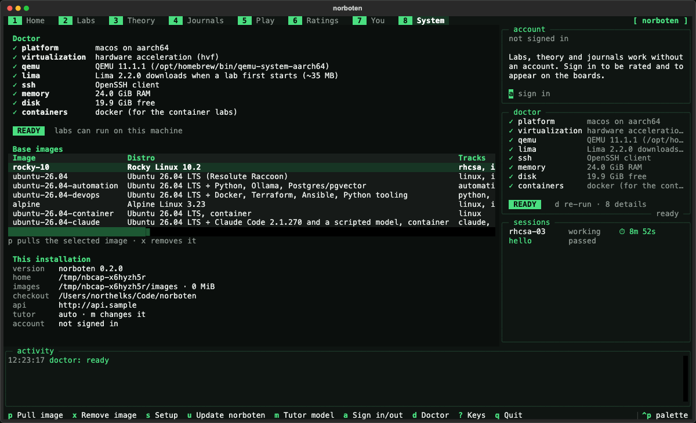
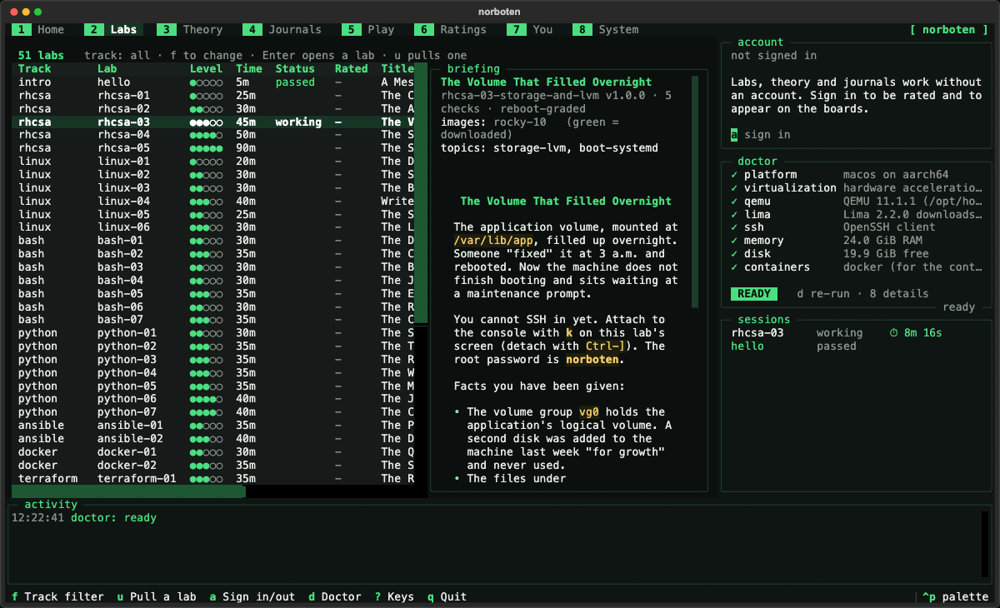
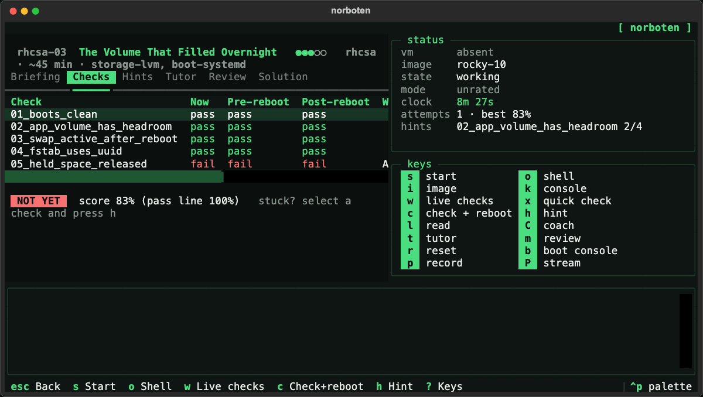
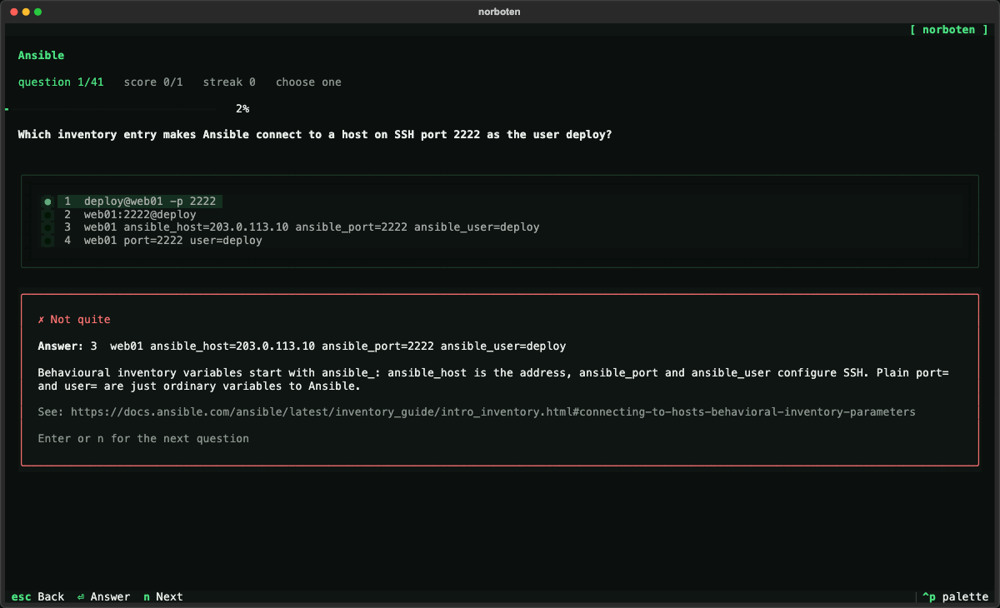
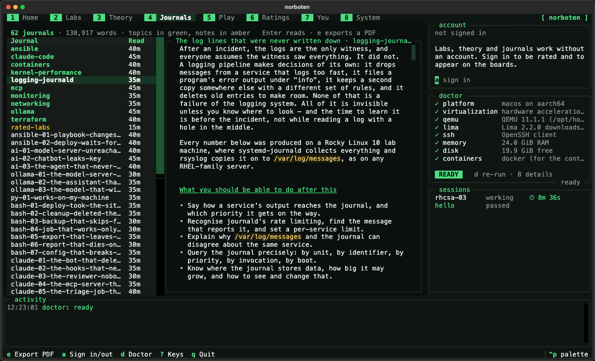
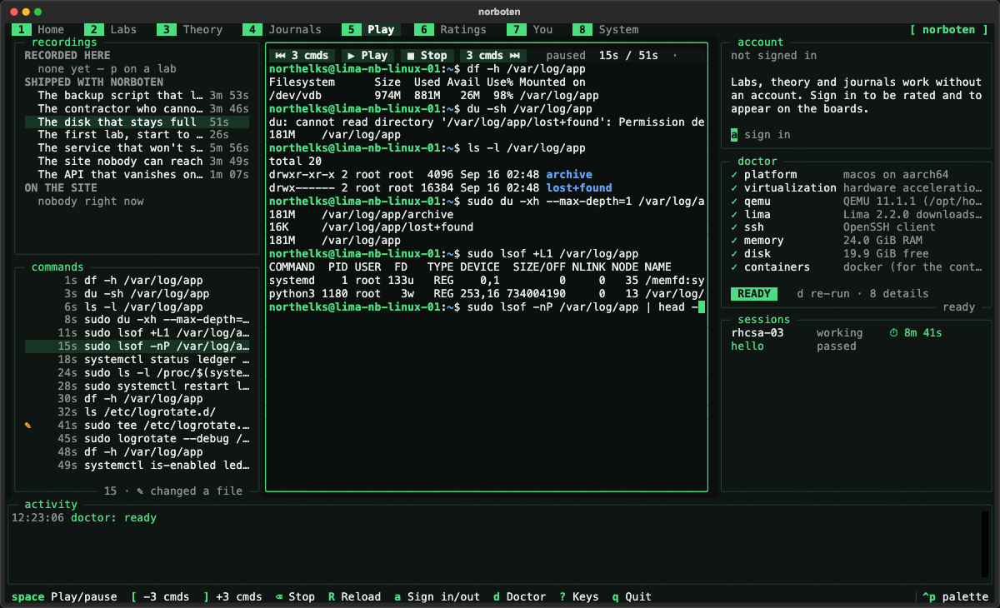
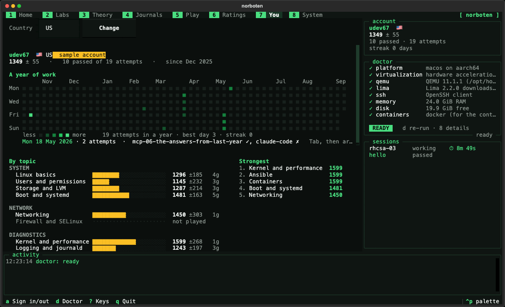
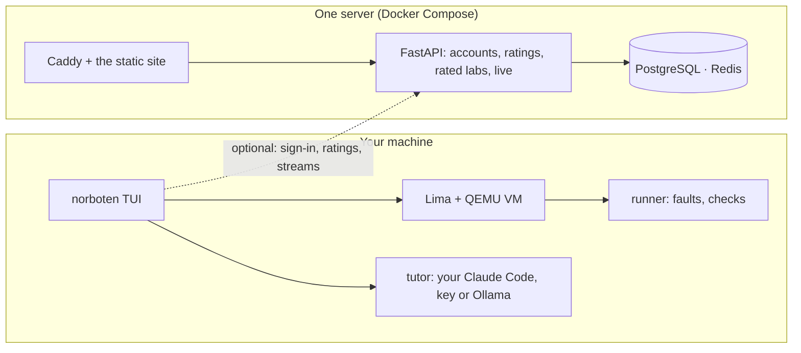

> **Pre-1.0, and it changes machine state.** Norboten downloads golden images and runs QEMU virtual
> machines on your computer; a lab then deliberately breaks the machine it created, so run it on a
> computer whose time you can afford to lose and never on a production host. The API, the database
> and the lab format still change without migrations, and **none of it has had a security review
> (!)**. Issues and labs are welcome.

# Norboten

**Learn Linux by fixing it.**

Norboten boots a real Linux VM on your machine with something genuinely wrong
with it. A service will not start. A disk will not mount. SELinux is quietly
denying a request. You find it and fix it — and then one key grades the machine
itself, reboots it, and grades it again.



It is one terminal interface — labs, theory, journals, recordings and your
profile, eight sections along the top on the keys `1` to `8` — and, for the
parts a laptop should not hold, one server. Everything here is measured or it is
not in this file.

## Where things stand

|                  |                                                                                                                                    |
| ---------------- | ---------------------------------------------------------------------------------------------------------------------------------- |
| Labs             | **51**, across ten tracks and `hello`, each proven solvable by the gate — every one of them re-gated on 2026-09-16 |
| Theory questions | **610**, in 61 banks; 132 of them are executed in a sandbox to prove their own answer                                              |
| Journals         | **62**: 51 lab journals, 10 topic journals and a note                                                                              |
| Base images      | rocky-10 · alpine · ubuntu-26.04 (+ devops, + automation), built by Ansible from the distributions' own cloud images               |
| Tests            | 1,221, plus the player and consultant checks in node, and the VM gate                                                          |
| Measured         | lab start 21.8 s · reset 8.3–8.6 s (Ubuntu 26.04; 27–35 s and 9.8–9.9 s on Alpine and Rocky) · live check panel 2.0 s              |

## The labs



A lab is a directory: a manifest, a briefing that states symptoms and never
causes, fault scripts, check scripts, a four-level hint ladder, a reference
solution, a journal and its own theory bank. The catalogue shows each one with
its level, time, your status and whether it is **rated** (`+`) or unrated (`−`).

| Track               | Base image            | What it teaches                                                                                                                                                                                                |
| ------------------- | --------------------- | -------------------------------------------------------------------------------------------------------------------------------------------------------------------------------------------------------------- |
| **Intro**           | any                   | `hello` — the whole path in five minutes                                                                                                                                                                       |
| **RHCSA**           | Rocky Linux 10        | Five labs on the current EX200 objectives, ending in a timed exam simulation with an unknown root password                                                                                                     |
| **Linux**           | Ubuntu 26.04 · Alpine | Disk space, services and AppArmor, a backup script that lies and a report to write, and two that run in a container: a team folder and a log that never rotates                                                |
| **Bash**            | Ubuntu 26.04 + devops | Seven scripts graded by running them against the grader's own directories: failing early, choosing files by their names, file names with spaces, a job that needs no caller's environment, publishing atomically, `pipefail`, literal templates |
| **Python**          | Ubuntu 26.04 + devops | Seven jobs and tools: an exit status that tells the truth, a virtual environment for every user, encodings stated, output that appears while it runs, the module search path, a lock against a second copy, a credential kept out of the log |
| **Ansible**         | Ubuntu 26.04 + devops | A playbook that never converges and a deploy stuck at a vault prompt                                                                                                                                           |
| **Docker**          | Ubuntu 26.04 + devops | A Redis queue that lost its jobs at every reboot and a Compose stack that could not find its API                                                                                                               |
| **Terraform**       | Ubuntu 26.04 + devops | A rename that would regenerate a secret and a site removed from the middle of a count                                                                                                                          |
| **Automation & AI** | Ubuntu 26.04 + stack  | A Python job under systemd, an AI gateway that was leaking its key, an agent job that never stopped, and Ollama four ways: behind nginx, open to the network, forgetting its rules, and too big for its memory |
| **Claude Code**     | container             | Six labs on real Claude Code with a scripted model, no token needed: permissions, hooks, subagents, MCP servers, a CI job that spends without limit, settings that disagree                                    |
| **MCP**             | container             | Six MCP servers as Claude Code meets them: a file server that shows everything, a page that gives orders, a token for someone else, a stdio server that talks too much, a proxy that holds the stream, scopes that disagree |

Unrated labs come with everything in this repository, the reference solution
included — for learning, it is often the clearest explanation a lab has. Writing
one: [docs/writing-a-lab.md](docs/writing-a-lab.md); the format is normative in
[docs/lab-spec.md](docs/lab-spec.md).

## Grading, and the reboot



`c` grades the machine, reboots it, and grades it again — a check passes only if
it passed both times, so a fix that does not survive the boot is not a fix. The
checks observe the machine rather than compare files, and each one fails with a
message written for someone who has just failed it. `r` puts the machine back to
its snapshot in about ten seconds, as often as you like.

## Theory



Every lab has a bank of its own, and ten topic banks cover what no single lab
does: Linux, networking, Bash, Python, Ansible, Terraform, Claude Code, MCP,
Ollama, and memory and CS as Linux shows it. Each question carries an explanation
and a reference; a question about what a command prints carries the command, and
`norboten dev verify-quiz` runs it in a container with no network to prove the
key. New questions are drafted on your own machine and reach a bank only after
two models that never saw the key agree on it, a critic passes it, it executes,
and it is not a near-duplicate ([docs/quiz-spec.md](docs/quiz-spec.md)).

## Journals



A journal is what a good colleague would explain after the lab: the mechanism,
one failure walked through on a real machine, the wrong turns people take, a
cheat sheet and review questions. There are three kinds — a **topic** journal
for a subject, a **lab** journal beside each lab, and a **note** for a design
worth writing down. They read in the TUI (`4`), on the site, and as a PDF; a hint
points at the section that explains it (`l`).

## Live



`p` on a lab records the shell on your own machine; `P` also streams it,
read-only, to the site's [Live](https://norboten.org/live/) page while it runs —
after asking, and never for theory. When nobody is streaming, the page plays a
wall of four real recorded sessions. Every command is listed with how long it
took, and every file changed is a diff.

## Ratings and profiles



An account is optional: every lab, journal and question bank works with no
account and no server. What an account adds is a profile — a year of work, the
attempts, and a **rating**. Ratings are Glicko-2, per topic, over the nineteen
topics of the taxonomy, so every number carries its uncertainty: a new profile
reads `1500 ± 350` until it has earned the right to be more precise. A rated
attempt runs against the clock and is scored like a match against the lab, whose
difficulty 1 to 5 plays at 1100 to 1900.

**Only rated labs move the board.** Unrated labs and banks are public and
offline, and their attempts are recorded on a profile without moving a rating.
Rated labs live in a private repository attached here as the submodule `rated/`:
the guest collects facts about the machine, signs them, and the server judges
them against criteria that never leave it. A plain clone works and simply leaves
`rated/` empty. The design and its honest limit are in
[docs/rated-labs.md](docs/rated-labs.md). The machinery is built and the first
rated labs are still being written, so **today every lab is unrated and the board
is empty**.

## Signing in

With GitHub, and nothing else: no password and no email. On the site it is one
button; in the terminal, `a` shows a short code to type at
`github.com/login/device` on any device, so a headless machine signs in too.
The API talks to GitHub itself, asks for no scope, and revokes GitHub's token as
soon as it has said who you are — no GitHub token is stored, and none reaches
your machine. Your public profile links to your GitHub account. Discord is
optional: link it on your account page and the weekly digest arrives as a direct
message from the Norboten bot. How it works:
[docs/architecture.md](docs/architecture.md#identity).

## The tutor and the consultant

The **tutor** (`t` in a lab) runs on your own Claude Code, API key or local
Ollama. It never receives the reference solution, and what it says is filtered
against that solution before you see it: it asks what you have checked and points
at the evidence you have not read yet. After the attempt, `m` reviews how you got
there. The **consultant** is the site's *Ask* button: it answers questions about
Norboten from the docs, journals, labs and theory, retrieved with BM25 over this
repository.

## The author plugin

Labs, questions and journals are written with `norboten-author`, a Claude Code
plugin in this repository. Give it an idea; it asks what the specification needs
and the idea leaves open, shows a plan, and after your yes drafts it — in your
session or in a subagent. It is finished when the solvability gate or the
question pipeline says so, not when the files look right.

```
/plugin marketplace add northelks/norboten
/plugin install norboten-author@norboten
```

More: [docs/claude-code-plugin.md](docs/claude-code-plugin.md).

## Quick start

macOS or Linux, x86-64 or arm64, with hardware virtualization (the container
labs — two Linux labs and the Claude Code and MCP tracks — need Docker or Podman
instead):

```sh
curl -fsSL https://norboten.org/install.sh | sh
```

It installs uv if it is missing, installs norboten, and opens the TUI on its
setup screen, which checks the machine, offers to install QEMU, and starts the
first lab. Norboten downloads and pins its own copy of Lima.

Then `2` for the labs, `Enter` on `hello`, `s` to boot and break it, `o` for a
shell, `c` to be graded. Everything is a key — `?` lists them, and
[docs/tui-reference.md](docs/tui-reference.md) explains each.

Everything lives in `~/.norboten`; no host directory is ever mounted into a lab
VM.

## How it works



Each lab VM is a [Lima](https://lima-vm.io) instance on QEMU, created from a
**golden image**: the distribution's own cloud image plus a baseline applied by
Ansible — every package the track needs, a serial console, a persistent journal,
shell history written after every command. Images and labs are content-addressed
and cached, so labs work offline.

Starting a lab (`s`) boots the VM once, powers it off, and takes a **disk
snapshot**. A standard-library-only Python runner is copied in to apply the
lab's faults, then deleted. Checking (`c`) copies in the check scripts, runs
them as the grading account, reboots the machine, and runs them again; a check passes only if
it passed both times. Resetting (`r`) restores the snapshot and cold-boots in
about ten seconds.

The server side — accounts and ratings, the consultant, an MCP server for AI clients, live
sessions, analytics and the site — is one Docker Compose project on one machine:
Caddy, FastAPI, PostgreSQL, Redis, Ollama, Prometheus and Grafana. The scheduled
and event-driven jobs — triage, stuck points, lab drafts, lab health, releases — run as
GitHub Actions, four of them through Claude Code
([docs/claude-code-in-norboten.md](docs/claude-code-in-norboten.md)).
`make stack-up` runs the same project on a laptop.

The whole system, part by part, with its figures: the site's
[How it works](https://norboten.org/how-it-works/). Full architecture:
[docs/architecture.md](docs/architecture.md),
[docs/data-model.md](docs/data-model.md),
[docs/pipelines.md](docs/pipelines.md), [docs/deploy.md](docs/deploy.md).

## Every lab is proven solvable in CI

For every lab and every base image it supports, CI boots a clean VM, applies the
faults, asserts that **every check fails**, runs the reference solution, then
checks, reboots and checks again — and every check must pass in both passes. A
lab that cannot be solved by its own solution cannot merge. The same gate runs
locally:

```sh
make lint-labs                     # the spec, without a VM
make validate LAB=rhcsa-03         # the gate, on every image the lab claims
```

## Contributing

Write a lab. That is the contribution the project wants most, and the gate above
decides whether it is finished, not a reviewer's taste. Open an issue for a lab
you want to exist, or draft one with the Claude Code plugin in this repository
([docs/claude-code-plugin.md](docs/claude-code-plugin.md)) and send the pull
request. Questions and journals are written the same way.

## Repository

```
cli/      the TUI, and the dev/image commands for authors and CI (the norboten package)
runner/   the standard-library runner injected into guests
api/      FastAPI: accounts, ratings, rated labs, the consultant, live sessions, analytics
labs/     the labs themselves
quizzes/  the theory banks
journals/ topic journals (each lab's journal lives beside the lab)
images/   the base image registry and the golden image builder
deploy/   the server: one Docker Compose project, install-server.py, deploy, backup and restore
ansible/  the image baseline and the server's configuration
automation/ the CI jobs (triage, stuck points, lab health, releases), Claude Code run headless
site/     norboten.org, built from this repository
docs/     the specifications and the documentation the site publishes
```

## Development

Requires Python 3.12 and [uv](https://docs.astral.sh/uv/).

```sh
make install            # .venv with every workspace package
make test               # the test suite, without the Docker-marked labs
make test-db            # the store and bus tests against real PostgreSQL and Redis (Docker)
make stack-up           # the whole server side on this laptop
make lint               # ruff + lab validation
make schema             # JSON Schemas for lab.yaml, registry.yaml and quiz banks
make image IMAGE=alpine # build a golden base image (needs Ansible)
make infra-validate     # ansible syntax, compose files, Caddyfile
make server-rehearsal   # the production playbook and deploy.sh on a local Ubuntu VM
uv run python site/build.py
```

Until golden images are published, point the CLI at locally built ones:
`NORBOTEN_IMAGE_MIRROR=images/out norboten`.

## The site

[norboten.org](https://norboten.org) is built from this repository by
`site/build.py`, so it says what the code says:

- [Features](https://norboten.org/features/) — every screen, as the app renders it
- [Labs](https://norboten.org/labs/) — the catalogue, with what each lab grades
- [How it works](https://norboten.org/how-it-works/) — the architecture, the data, the pipelines
- [Journals](https://norboten.org/journals/) — the reading, by topic and by lab
- [Live](https://norboten.org/live/) — recorded and live sessions, in a real terminal player
- [Ratings](https://norboten.org/players/) — the board, the profiles and the analytics behind them
- [Docs](https://norboten.org/docs/getting-started/) — the specifications and the documentation

## Licence and support

Apache-2.0. Labs are built on Rocky Linux, Ubuntu and Alpine; no Red Hat content
is redistributed.

Norboten is free and self-hostable, and it is paid for by people who like it:
donations go through **Stripe** at
[norboten.org/donate](https://norboten.org/donate/), one-off or monthly.

© 2026 Ihar Petushkou.
